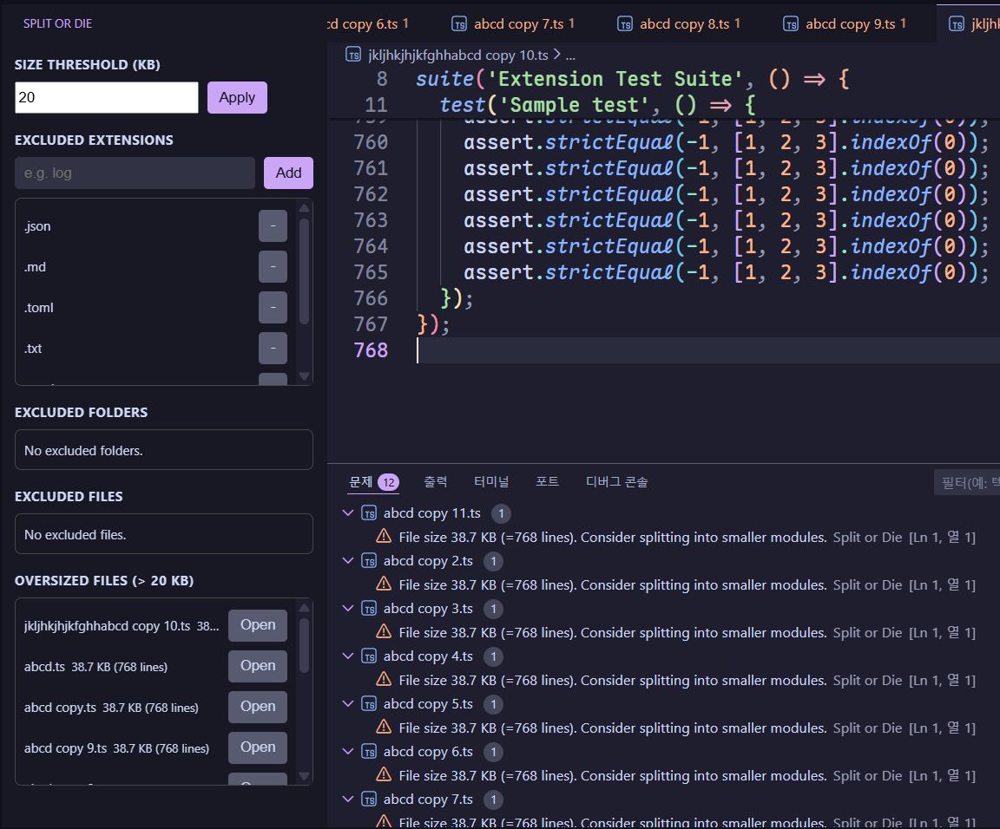

# Split or Die

Enforce smaller, modular files by flagging oversized or complex code.

## Features

- Scans the workspace and reports files larger than a size threshold.
- Uses real line counts in diagnostics and the oversized list.
- Runs on startup, on save, and via command palette.
- Activity Bar view to manage exclusions and see oversized files.
- Exclude folders/files from the Explorer context menu.
- Toggle extension exclusions from the Explorer context menu.
- Skips common build/vendor folders and non-code extensions by default.

## Usage

- Activity Bar: open **Split or Die** to manage exclusions and view oversized files.
- Size Threshold: adjust the KB threshold and click **Apply**.
- Command Palette: `Split or Die: Scan Workspace`
- Explorer context menu:
  - `Split or Die: Toggle Folder Exclusion`
  - `Split or Die: Toggle File Exclusion`
  - `Split or Die: Toggle Extension Exclusion`

## Extension Settings

This extension contributes the following settings:

- `splitOrDie.enable`: Enable or disable diagnostics.
- `splitOrDie.sizeThresholdKb`: Report files larger than this size (KB). Default: `20`.
- `splitOrDie.runOnStartup`: Run a scan when VS Code finishes starting.
- `splitOrDie.runOnSave`: Check the saved file and update diagnostics.
- `splitOrDie.excludeGlobs`: Glob patterns excluded from scans.
- `splitOrDie.excludeExtensions`: File extensions to ignore (without leading dot).
  - Default: common non-code formats (docs, images, media, archives, binaries, fonts, DBs, temp files, etc.).

## Release Notes

### 1.0.3

- Added more non-code default exclusions (sqlite/jsonc/dotfiles).
- Internal refactor to split large extension modules.
